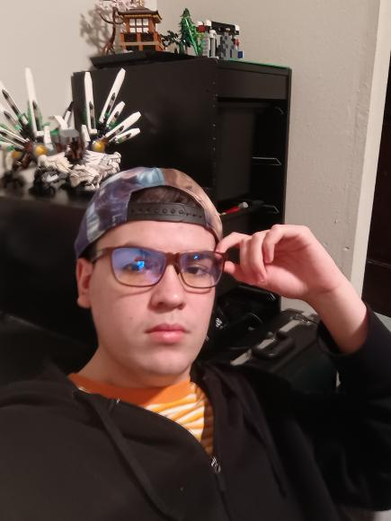

# Hi I am Ethan! 🫴

### I am a student enrolled at CAL (Center for Advanced Learning) and am taking the Tech Lab Studio. This program involves many things in the tech realm including:
* **Computer Science**
* **Info Technology**
* **Web Programming**
### On my own time I enjoy comic books, philosphy, music, videogames, and chemistry.

### Based off the programs I am in, I have various skills. These include:
* **Languages:** Python, JavaScript, HTML/CSS, `Spanish`
* **Tools:** VS Code, Git, Terminal
* **Soft Skills:** Problem Solving, Teamwork, Communication

### Learning Recources
1. [Code Pen](https://codepen.io/)
2. [Brillant](https://brilliant.org/home/)
3. [Codecadamy](https://www.codecademy.com/)
4. [JuiceMind](https://juicemind.com/)

>"I don't care who you were, but who you are trying to be" - Batman
### Contacts
* Email: vasquez41@calcharter.org
* Instagram: [ethanswag505](https://www.instagram.com/ethanswag505/?__pwa=1)
* Phone number: 503-498-0203

